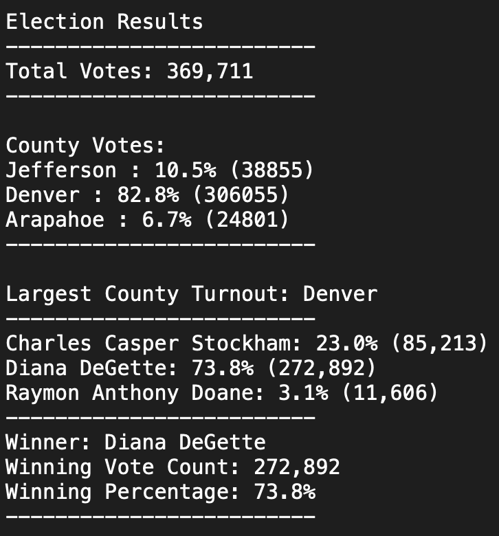
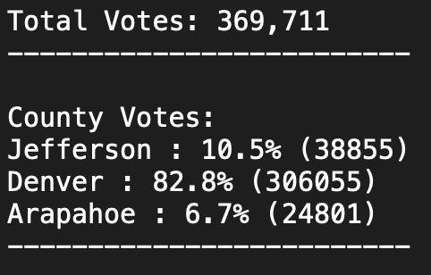
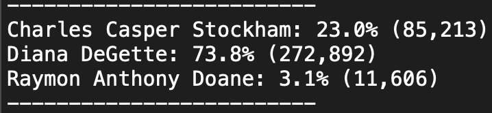
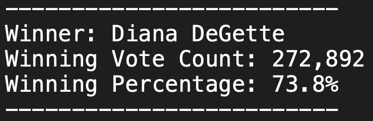

# Election_Analysis
Conducting Election Analysis using Python and VSCode

## Overview of Election Audit
Overview of Election Audit: Explain the purpose of this election audit analysis.

## Election Audit Results: Below is a brief analysis ofthe Election Outcome
Election-Audit Results: Using a bulleted list, address the following election outcomes. Use images or examples of your code as support where necessary.

### Total number of County votes and County Percentages:
How many votes were cast in this congressional election?
Provide a breakdown of the number of votes and the percentage of total votes for each county in the precinct.

### Candidate Votes and Percentages:
Which candidate won the election, what was their vote count, and what was their percentage of the total votes?

### Winner of the Election:
Which candidate won the election, what was their vote count, and what was their percentage of the total votes?## Election Audit Summary:

## Election Audit Summary
Election-Audit Summary: In a summary statement, provide a business proposal to the election commission on how this script can be used—with some modifications—for any election. Give at least two examples of how this script can be modified to be used for other elections.

[election_results](Resources/election_results.csv)
