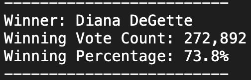

# Election_Analysis
Conducting Election Analysis using Python and VSCode

## Overview/Purpose of Election Audit

The purpose of this Election Audit was to provide the election commission additional election data along with a written analysis highlighting voter turnout for each county, percentage of votes from each county, the county with the highest turnout, and of course the winner of the election. Of note, in order to analyze the data, python and the vscode platform were used.

## Election Audit Results: 
Below is a detailed breadown of the Election Results in bulletized format. Additional data could be provided upon request.  

* Total number of County votes and County Percentages:
  * As depicted in the image below, there were a total of 369,711 total votes cast in the election. Out of the 369,711 votes, Denver was the county that accounted for the highest number of votes [306,055], highest turnout, and highest percentage of the votes [82.8%], followed by Jefferson County and Arapahoe County respectively. See below image for the full detail. 

* Candidate Votes and Percentages:
  * Out of the 369,711 total votes, [73.8%] were cast for Diana DeGette with her final result of [272,892] votes. This was significantly higher than the other candidates. As depicted in the below image, Charles Casper Stockham only accounted for [23%] of the total votes while Raymon Anthony Doane accounted for lowest percentage of votes [3.1%]. See below image for full detail including total number of votes for each candidate.  

* Winner of the Election:
  * As mentioned above, Diana DeGette was the candidate with the highest number of votes and highest vote percentage which makes her the winner of the election. Below is winning result. Congratulations to Diana DeGette!

## Election Audit Summary:
Election-Audit Summary: In a summary statement, provide a business proposal to the election commission on how this script can be used—with some modifications—for any election. Give at least two examples of how this script can be modified to be used for other elections.

[election_results](Resources/election_results.csv)
